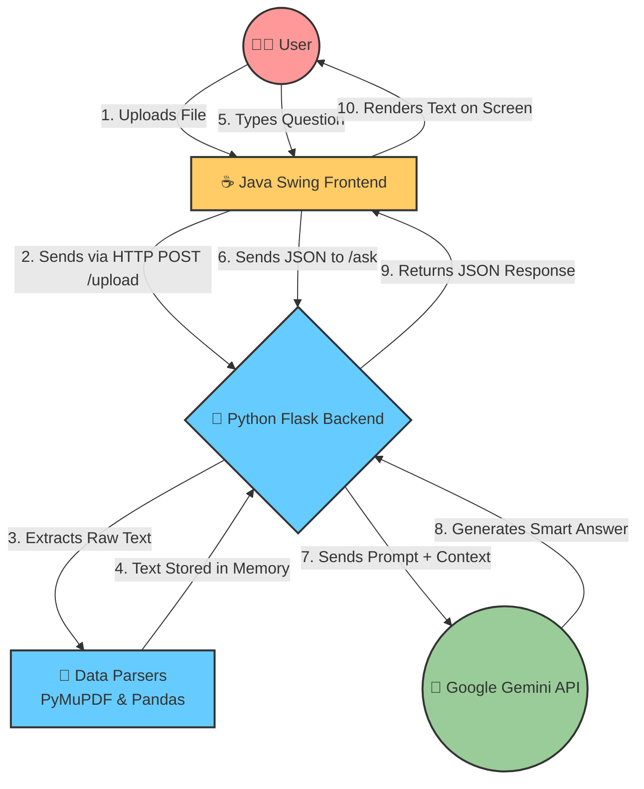

<div align="center">
  <h1>🧠 DocMindAI</h1>
  <h3>Your Personal AI Document Assistant</h3>
  
  <p>
    
    
    
  </p>
</div>

**DocMindAI** is a powerful, full-stack desktop application designed to bridge the gap between human curiosity and complex documents. Powered by **Google Gemini AI**, it seamlessly reads text from PDFs, Word documents, Excel datasets, and CSV files, enabling you to ask context-aware questions and retrieve data instantly without hours of manual reading.

---

## ✨ Why DocMindAI?

- ⏱️ **Save Time**: Stop scrolling through 100-page PDFs. Just ask for what you need!
- 🌍 **Language Agnostic**: Fully supports foreign languages and unicode characters (e.g., Hindi, Bengali).
- 🧩 **Multi-Format**: Out-of-the-box support for `.pdf`, `.docx`, `.xlsx`, and `.csv`.
- 💻 **Clean Interface**: A gorgeous, modular Java Swing UI that feels responsive and native.

---

## 🏗️ Architecture & Tech Stack

| Component | Technology | What it does |
| :--- | :--- | :--- |
| **Frontend** | Java (Swing) | Provides the graphical user interface, chat panels, and upload buttons. |
| **Backend** | Python (Flask) | The RESTful API server that acts as the bridge between the UI and AI. |
| **AI Engine** | Google Gemini | The `gemini-2.5-flash` model handles natural language processing and reasoning. |
| **Data Parsers** | PyMuPDF, Pandas | Extracts raw text from complex file structures and spreadsheets. |

---

## 🔄 How It Works (The Workflow)

DocMindAI utilizes a decoupled architecture where the Java client communicates with the Python server via local REST APIs. Here is the step-by-step data flow:



---

## 🚀 Installation & Setup

### Prerequisites
Make sure you have the following installed on your machine:
*   [Java Development Kit (JDK) 11+](https://www.oracle.com/java/technologies/downloads/)
*   [Python 3.8+](https://www.python.org/downloads/)

### 1. Clone the Repository
```bash
git clone https://github.com/Himanshu-Singh11/DocMind.git
cd DocMind
```

### 2. Setup the Python Backend
Navigate to the backend directory, install the required libraries, and set up your environment variables.

```bash
cd backend
pip install -r requirements.txt
```

**Configure API Key:**
Create a `.env` file inside the `backend` folder and add your Google Gemini API key:
```env
GEMINI_API_KEY=your_google_gemini_api_key_here
```

### 3. Run the Backend Server
```bash
python3 app.py
```
*The server will start running on `http://127.0.0.1:5000`*

### 4. Run the Java Frontend
Open a **new terminal window**, navigate to the frontend folder, compile, and execute the application:

```bash
cd frontend
javac *.java
java Main
```

---

## 💡 Usage Guide

1. **Boot Up:** Ensure both the backend server and Java frontend are running.
2. **Upload:** Click the **Upload Document** button in the Java interface and select a compatible file.
3. **Wait:** Wait for the upload success confirmation in the status bar.
4. **Chat:** Type your question in the chat box at the bottom and hit **Send**.
5. **Learn:** Receive AI-generated insights instantly based on your document!

---

## 🤝 Contributing
Contributions are always welcome! Feel free to fork the repository, create a feature branch, and submit a pull request. Let's build the future of document analysis together!

---
<div align="center">
  <i>Built with ❤️ by Himanshu Singh</i>
</div>
